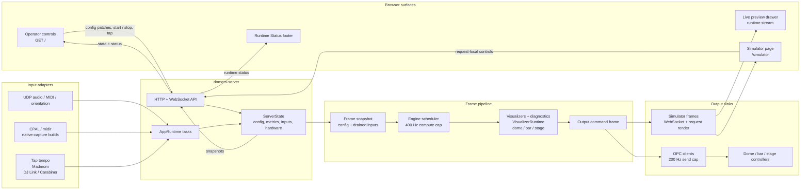

# Architecture

`dome-rs` is a headless Rust lighting control runtime with browser controls and simulator views.

## Crates

- `domers-core`: shared colors, Spectrum palette semantics, beat timing, config types, TOML config import, and migration warnings.
- `domers-engine`: scheduler and frame orchestration.
- `domers-outputs`: dome/bar/stage commands, topology, simulator sinks, and OPC encoding.
- `domers-inputs`: audio/MIDI payload parsing, Madmom and DJ Link sidecar parsing, and orientation datagram classification.
- `domers-visualizers`: visualizer inventory, dome/bar/stage renderers, diagnostics, and frame-hash harnesses. Implementation is split under `crates/visualizers/src/` into `inventory`, `input`, `render`, `runtime/` (persistent state machines), `dome/` (per-visualizer frame builders), shared helpers (`geometry`, `math`, `buffer`, `color_util`, `rng`), and `tests/` (golden parity).
- `domers-server`: runtime state, HTTP/WebSocket API, input tasks, simulator frames, and hardware output.
- `domers-test-support`: fake clocks and deterministic test utilities.

## Runtime Shape



The runtime has one authoritative state owner: `ServerState`. Browser actions and
input adapters enter through explicit API/task paths, engine frames render from a
snapshot, and output command frames fan out to OPC clients plus browser simulator
views. Stateful dome visualizers keep per-mode state in `VisualizerRuntime`
(Snakes throttling, Race/Volume/Flash motion, buffer-backed Radial/Splat/Paintbrush,
TV Static RNG, switch-wipe on mode change). Browser simulator views render intended
engine output; they do not read back from OPC hardware sockets.

## Runtime Surface

The server crate implements both the in-process `ServerState` contract and the runnable HTTP/WebSocket adapter. The `domers` binary loads TOML config, serves the browser shell, exposes JSON API endpoints, and streams simulator frames over WebSocket. The browser shell source is React and TypeScript under `ui/src`, with shared CSS in `ui/src/styles.css`; the Rust server embeds the checked `ui/dist` build output.

HTTP and WebSocket surface:

- `GET /`: browser operator shell
- `GET /simulator`: dedicated simulator page
- `GET /assets/main.js`: built React/TypeScript browser bundle
- `GET /assets/styles.css`: shared UI stylesheet
- `GET /main.mjs`: compatibility alias for the built browser bundle
- `GET /api/health`: health JSON
- `GET /api/state`: running state, engine config, simulator inputs, metrics, OPC target status, and input status
- `POST /api/start`: start the engine loop
- `POST /api/stop`: stop the engine loop
- `PATCH /api/config/dome`: patch runtime dome controls: active visualizer, flash speed, and palette slot
- `PATCH /api/config/diagnostics`: patch dome, bar, and stage diagnostic/test-pattern controls
- `PATCH /api/config/palette`: patch one runtime palette entry, including `color2` gradients
- `POST /api/input/tap`: record one tap-tempo input
- `GET /api/dome/geometry`: Spectrum-derived dome projection geometry
- `GET /api/dome/mapping`: Spectrum-derived dome strut/LED mapping
- `PATCH /api/simulator`: patch shared simulator input state used by runtime preview rendering
- `GET /api/simulator/frame`: produce one runtime preview frame
- `POST /api/simulator/sandbox-frame`: produce a dedicated simulator page frame from request-local controls without mutating runtime state
- `GET /ws/simulator`: simulator frame and metrics stream

## Timing Contracts

- Engine target: 400 Hz compute cap.
- OPC target: independent 200 Hz send cap.
- Browser simulator: server frames are emitted every 10 ms from the 400 Hz engine loop, matching Spectrum's WPF simulator timer; the browser still coalesces paints with `requestAnimationFrame`.

Timing tests use this shape:

```text
fake clock -> scheduler frame -> visualizer render -> simulator frame -> metrics update
```

## State And Concurrency

Each engine frame uses a stable config snapshot plus a drained batch of input/control events. Browser config edits, MIDI commands, audio samples, orientation datagrams, and Madmom beat reports enter through explicit event paths instead of mutating shared UI state mid-frame.

Stress tests cover:

- config updates during frame production
- MIDI replay during visualizer rendering
- simulator frame production during input bursts
- metrics updates after each frame

## Configuration

`dome-rs` native configuration is TOML. Runtime code loads TOML, not XML. Legacy Spectrum XML is handled by the import command documented in [`configuration.md`](configuration.md). The runtime expands the TOML color-palette banks and shared entries into Spectrum's 64 absolute palette slots before visualizers render.

## Simulator Preview

The live control page keeps simulator work lazy. It fetches runtime state on load, then starts geometry/mapping requests, one preview frame request, and the simulator WebSocket when the `Preview` drawer opens. The dedicated `/simulator` page starts the simulator immediately and uses request-local controls through `POST /api/simulator/sandbox-frame`, so changing that page does not change runtime config or hardware output.

## Beat And Input Runtime

The runtime accepts tap tempo, MIDI commands, audio volume samples, orientation datagrams, Madmom-compatible `BEAT:{seconds}` lines, and DJ Link/Carabiner-compatible tempo lines through explicit input paths. `domers run` can start optional UDP adapters for audio, MIDI, and orientation, and optional native CPAL/midir capture in `native-capture` builds. It manages the Madmom sidecar when `tempo.source = "madmom"` and the DJ Link sidecar when `tempo.source = "link"`. Human tap tempo uses wall-clock input time rather than engine frame time. The server exposes adapter targets, event counters, MIDI level-driver values, orientation devices, and last errors in `/api/state`.

## Intentional Deviations

Spectrum compatibility decisions and explicit differences are tracked in [`intentional-deviations.md`](intentional-deviations.md). Keep this file focused on `dome-rs` architecture; put historical comparisons and deliberate departures there.
